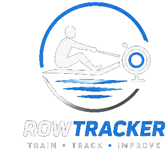
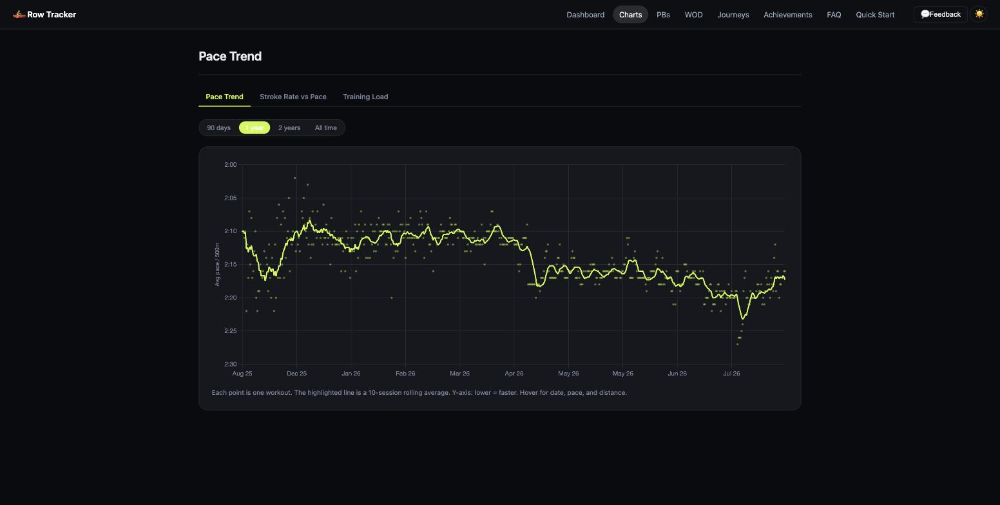
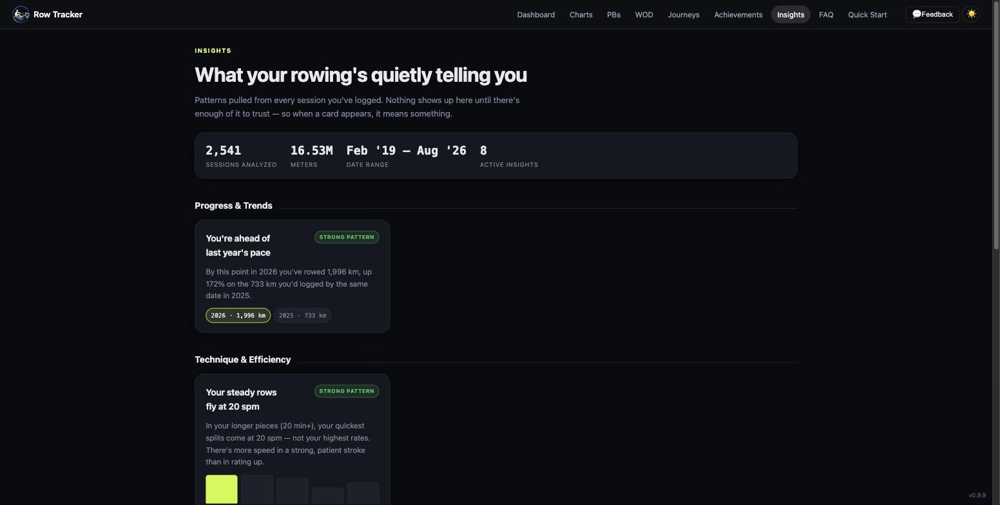

<p align="center">
  <picture>
    <source media="(prefers-color-scheme: dark)" srcset="static/img/logo-dark.png">
    <source media="(prefers-color-scheme: light)" srcset="static/img/logo-light.png">
    
  </picture>
</p>

# Row Tracker

[](https://github.com/dsubtle1/row-tracker/actions/workflows/tests.yml)
[](LICENSE.md)

A self-hosted personal rowing tracker for Concept2 RowErg athletes. Syncs automatically from the Concept2 Logbook API, tracks personal bests, generates daily workouts, and turns your metres into virtual journeys around the world.

Built with Flask, SQLite, and Docker. Runs on a home server at a single port with no external dependencies.

> **Your server, your credentials, your data.** Row Tracker is 100% self-hosted — there is no Row Tracker backend and nothing runs on infrastructure anyone else controls. You run the container yourself and supply your own Concept2 API credentials, so it talks directly to *your* Concept2 Logbook account, not through any server of ours. All data (workouts, PBs, badges, journeys) is stored in a SQLite file on your own machine, under your own control. Two features are the exceptions worth calling out explicitly: the optional AI coaching feature (workout context sent to Anthropic's API using an API key you provide — see [AI-Assisted Coaching](#ai-assisted-coaching-optional) below), and the in-app **💬 Feedback** button, which emails the developer directly using your own SMTP credentials — see [below](#feedback) for what that does and doesn't send.

---

## Screenshots

### Dashboard


### Workout of the Day


### Virtual Journeys


### Charts


### Insights


### Quick Start Guide


---

## Features

**Dashboard**
- Circular gauge for lifetime metres, progress toward the next milestone (100k up through 100M)
- Mini pace-trend and weekly-volume sparklines
- "Your Progress" checklist — every active or completed virtual journey at a glance
- "Journey Map" teaser — a decorative mini map preview of your most-progressed active journey, linking through to its full route page

**Training Data**
- Automatic sync from the Concept2 Logbook API — nightly at 3:00 AM, or on demand
- CSV import for seasons rowed before API access existed — upload a Concept2 Logbook export, duplicates skipped automatically
- Export workout history and personal bests as CSV or JSON, for use outside the app or as a portable backup
- Full workout history with a paginated, filterable list (date range, distance range) and an enriched detail view
- Enriched workout detail — heart rate (min/avg/max/ending with zone classification), per-split breakdown, avg watts, drag factor, stroke count
- Editable free-text notes on any workout — a place for "felt strong today" or "new shoes, different footplate setting"
- Per-stroke pace & stroke-rate chart on the workout detail page, fetched from Concept2 on first view and cached
- 52-week volume heatmap — click any day to see that session's details
- Head-to-head comparison — pick any two workouts from the list for a split-by-split pace chart side by side

**Personal Bests**
- 8 categories: 100m, 500m, 1000m, 2000m, 5000m, 10000m, 30min, 60min
- Recalculated automatically after every sync
- Improvement delta vs previous PB
- Stale flag for PBs not tested in 90+ days
- Full progression chart per category — every genuine record-breaking result over time, not just current-vs-previous

**Charts**
- Pace over time with 10-session rolling average
- Stroke rate vs pace efficiency scatter
- CAWR (acute:chronic workload ratio) load management chart

**Insights**
- Automatic pattern-spotting across your whole history — timing, progress, technique, and habit patterns surfaced as plain-language cards ("Something about Saturdays just clicks", "Your steady rows fly at 20 spm")
- Every insight is gated on a minimum-sample and significance check, so nothing appears until there's enough data to trust it — cards are tagged **Strong pattern** or **Early signal** so a claim never overstates its certainty
- Transparency for the gated ones: below the 60-workout sample floor, a banner shows your progress toward it; a few pattern checks (day-of-week, rest-day effect) that ran but found nothing say so explicitly rather than just staying silent — and never promise an eventual unlock for a pattern that may not exist
- Year-over-year progress and a **Milestones** section of all-time highlights — years rowing, biggest single day, total hours on the erg, longest streak
- Actionable recommendations on the strongest patterns, some linking straight into the WOD generator
- Optional AI "coach's read" (`USE_AI_INSIGHTS=true` + `ANTHROPIC_API_KEY`) — Claude Haiku writes a short first-person synthesis tying the cards together; it only ever rephrases the deterministic facts (never invents a number), and every card renders fine without it

**Workout of the Day**
- Rule-based periodization engine — reads last 28 days to set training phase
- Target pace calculated from your 2k PB with zone offsets
- Warm-up, main set, cool-down, and coaching notes generated daily
- Training-load transparency — today's CAWR value is shown on the WOD card whenever it swaps in an easier or harder session for you, so the "why" is never hidden
- Optional AI-assisted coaching narrative (`USE_AI_WOD=true` + `ANTHROPIC_API_KEY`) — Claude Haiku writes the warm-up/cool-down/coaching text for each WOD, tailored to your recent training load; the structured workout itself stays rule-based, and it falls back to the static text automatically if the API is unavailable
- Random WOD generator — choose intensity, effort level, and workout type; your free-text notes are passed to the AI coach when enabled
- 27 distinct workout templates
- WOD history calendar — browse past months day by day, colour-coded for pending vs. completed, click any day for the full workout detail
- Actual-vs-planned feedback — marking a WOD complete auto-links the one workout you synced that day (when it's unambiguous) and shows whether you hit target pace within 2%

**Gamification**
- 17 badges across Performance, Volume, Consistency, and Efficiency categories — the four
  lifetime-metres badges show an ETA projected from your current 28-day pace while locked
- Season challenges — quarterly distance, PB attempts, consistency, monthly volume
- You vs. Past You — compare this month against last month, 3 months ago, and 12 months ago
- Stale PB nudges on the Achievements hub
- Notifications when you earn a badge, cross a lifetime-metres milestone, or complete a virtual journey — email by default, with optional ntfy.sh, Discord, and generic-webhook channels you can enable independently (`.env`, no UI)

**Virtual Journeys**
- Row the world's great routes — metres rowed move you along the route in real time
- Real maps (Leaflet.js + OpenStreetMap) — every waypoint plots at its real-world coordinates, with a smoothed route line through them and your current position as a pulsing marker
- Rhine River — Basel, Switzerland to Rotterdam, Netherlands · 820 km · 14 waypoints
- Holland Tour — Amsterdam scenic loop · 550 km · 17 waypoints
- Trans-Canada Highway — Victoria, BC to St. John's, NL · 7,821 km · 24 waypoints
- Route 66 — Chicago, IL to Santa Monica, CA · 3,940 km · 24 waypoints
- Waypoint ETAs based on 28-day rolling average pace
- Click any waypoint (map or list) for a popup with details and a Wikipedia link
- Multiple journeys can run simultaneously

**Other**
- "Last synced" indicator on the Dashboard, and a notification (email and/or ntfy/Discord/webhook,
  same channels as above) if a nightly sync, PB recalc, badge evaluation, or backup job fails —
  so a broken sync doesn't sit unnoticed
- Nightly automated database backup (30-day retention), written to `data/backups/`
- One-click restore from any backup on the Export Data page — a type-to-confirm dialog guards
  against accidental clicks, and restoring first snapshots your current data so the restore
  itself is undoable
- Dark mode default with light mode toggle (persisted)
- Fully responsive — iPhone and iPad optimised with hamburger nav drawer
- Installable as a home-screen app (PWA) — manifest, app icon, and a service worker that caches static assets for a faster reload
- In-app feedback form (email delivery via Flask-Mail)
- FAQ and Quick Start guide included

---

## Tech Stack

| Layer | Technology |
|---|---|
| Backend | Python 3.11 · Flask · SQLAlchemy · Flask-WTF (CSRF) |
| Database | SQLite (single file, Docker volume) |
| Scheduler | APScheduler (embedded, nightly sync) |
| Frontend | Jinja2 · Vanilla JS · Chart.js |
| Container | Docker · Docker Compose |
| Email | Flask-Mail · Gmail SMTP |
| Data source | Concept2 Logbook API |

---

## Self-Hosting

### Prerequisites

- Docker and Docker Compose — on Mac or Windows, the easiest way to get both is [Docker Desktop](https://www.docker.com/products/docker-desktop/), which bundles Compose automatically. On Windows, Docker Desktop requires WSL2, which its installer will prompt you to enable if it isn't already. On Linux, install [Docker Engine](https://docs.docker.com/engine/install/) directly (Compose is included as the `docker compose` plugin in current versions).
- A Concept2 Logbook account with workout history
- A Concept2 API bearer token (request from [log.concept2.com](https://log.concept2.com))
- A Gmail account with an app password (for the feedback email feature)

### Setup

No need to clone the repo for this — everything you need is two files.

**1. Create a project directory**

```bash
mkdir row-tracker && cd row-tracker
```

**2. Create your `.env` file**

Create a file named `.env` with:

```
SECRET_KEY=your-secret-key-here
TZ=America/Toronto
C2_CLIENT_ID=your-c2-client-id
C2_CLIENT_SECRET=your-c2-client-secret
C2_REFRESH_TOKEN=your-c2-bearer-token
MAIL_USERNAME=your-gmail@gmail.com
MAIL_PASSWORD=your-gmail-app-password
USE_AI_WOD=false
ANTHROPIC_API_KEY=
```

`TZ` sets the container's clock, which is what the 3:00 AM nightly scheduler reads — without it the
container defaults to UTC regardless of where it's hosted, so "3:00 AM" silently means 3:00 AM UTC.
Use an [IANA time zone name](https://en.wikipedia.org/wiki/List_of_tz_database_time_zones) for your
own location, e.g. `America/New_York`, `Europe/London`.

`ANTHROPIC_API_KEY` is only needed if you set `USE_AI_WOD=true` — get one at [console.anthropic.com](https://console.anthropic.com/).

**3. Create `docker-compose.yml`**

```yaml
services:
  row-tracker:
    image: ghcr.io/dsubtle1/row-tracker:latest
    container_name: row-tracker
    ports:
      - "7376:7376"
    volumes:
      - ./data:/app/data
      - ./csv-data:/app/csv-data:ro
    env_file:
      - .env
    restart: unless-stopped
```

Every tagged release is published as a multi-arch image (`linux/amd64` + `linux/arm64`, so this
covers Raspberry Pi and other ARM boards too). Pin to a specific version instead of `latest` if you
want (e.g. `ghcr.io/dsubtle1/row-tracker:0.24.0`) — see the
[Releases page](https://github.com/dsubtle1/row-tracker/releases) for available tags.

**4. Run it**

```bash
docker compose up -d
```

**5. Open the app**

```
http://localhost:7376
```

Click **Sync Workouts** on the dashboard to pull in your full workout history from the Concept2 Logbook.

### Building from source instead

Want to run unreleased changes, or contribute? Clone the repo and build locally instead of
pulling the image:

```bash
git clone https://github.com/dsubtle1/row-tracker.git
cd row-tracker
cp .env.example .env   # then edit it as in step 2 above
```

The repo's `docker-compose.yml` already uses `build: .` in place of the `image:` line above —
nothing to change there. Then:

```bash
docker compose up -d --build
```

Everything else (`.env`, volumes, ports) is identical either way.

---

## AI-Assisted Coaching (Optional)

Everything in Row Tracker works fully offline with `USE_AI_WOD=false` (the default) — the WOD engine is entirely rule-based and never makes an external call. If you opt in by setting `USE_AI_WOD=true` and supplying your own `ANTHROPIC_API_KEY`:

- Row Tracker sends a small amount of workout context (workout type, target pace, recent training load, and any notes you typed into the Random WOD Generator) directly to the Anthropic API, using the key you provided.
- Anthropic's response — just the coaching text — is used to replace the warm-up/cool-down/coaching notes for that WOD. No other data (your name, account, history, or PBs beyond what's needed for that one prompt) is sent.
- Leave `ANTHROPIC_API_KEY` blank (the default) and this feature is completely inert.

The **Insights** page has the same optional AI layer, gated separately by `USE_AI_INSIGHTS=true` (also off by default). When enabled, Row Tracker sends only the already-computed insight facts (the patterns and their numbers — no raw workout history) to Anthropic, and gets back a short coaching paragraph that rephrases them. The insight cards themselves are computed entirely on your server and show with or without the API key.

Everything else — sync, PBs, badges, charts — is between your server and the Concept2 API only. Virtual Journeys are a partial exception: the route maps fetch tile images live from OpenStreetMap on every view (no offline cache, unlike the rest of the app), and clicking a waypoint sends its name to Wikipedia's API to fetch a summary and photo. Neither sends any of your workout data — just place names and map viewport coordinates, the same as any other web map.

---

## Feedback

Every deployment's **💬 Feedback** button sends to the developer's inbox, not your own — the recipient is fixed in the code, not something your `.env` controls. It sends using *your* configured Gmail credentials (`MAIL_USERNAME`/`MAIL_PASSWORD`), but the destination is always the same regardless of who's running the instance. It sends: the category you picked, an optional name you type in (defaults to "Anonymous"), your message, and which page you were on. Nothing else — no account data, no workout history, no PBs.

This is separate from badge/milestone/journey-completion notifications, which default to `NOTIFY_EMAIL` going to *your own* inbox (see the Features list above) — those never leave your server's control. If you opt into the additional `NOTIFY_NTFY_TOPIC`, `NOTIFY_DISCORD_WEBHOOK_URL`, or `NOTIFY_WEBHOOK_URL` channels (all blank/off by default), the same notification text is also sent to that third-party service — worth knowing before you set one, since it's the one deliberate exception to "nothing leaves your server" beyond Feedback and optional AI coaching.

If you'd rather not send anything to a third party at all, don't fill in Gmail credentials — the Feedback button will just fail with an on-screen error instead of silently doing nothing, so this is a deliberate opt-out (no `.env` flag currently gates it separately from AI coaching's `USE_AI_WOD`).

---

## Project Structure

```
row-tracker/
├── app.py                  # Flask app factory
├── models.py               # SQLAlchemy models
├── c2_api.py               # Concept2 API client
├── pb_engine.py            # Personal best calculation
├── badge_engine.py         # Badge evaluation
├── wod_engine.py           # WOD generation
├── ai_coach.py             # Optional AI coaching narrative for WODs (USE_AI_WOD)
├── insights_engine.py      # Deterministic pattern-spotting rules for the Insights page
├── insights_ai.py          # Optional AI "coach's read" synthesis (USE_AI_INSIGHTS)
├── scheduler.py            # APScheduler jobs: nightly sync, PB recalc, badges, backup
├── backup.py               # Nightly SQLite backup with retention pruning
├── notify.py               # Notifications (email/ntfy/Discord/webhook): badges, milestones, journey completions
├── blueprints/
│   ├── tracker.py          # Core routes and HR zone filters
│   ├── wod.py              # Workout of the Day routes
│   ├── gamification.py     # Badges, challenges, journeys
│   └── feedback.py         # Feedback form
├── templates/              # Jinja2 HTML templates
├── static/                 # CSS, JS, PWA manifest and icons
├── data/                   # SQLite database + nightly backups (Docker volume)
├── .env.example            # Environment variable template
├── VERSION                 # Current SemVer, read by app.py at startup
├── CHANGELOG.md            # Release history
├── docker-compose.yml
└── Dockerfile
```

---

## Roadmap

- [ ] Force-curve / drive-recovery-time visualisation per stroke (basic pace & stroke-rate-over-time chart already shipped) — **note:** likely blocked by data availability; Concept2's Logbook API only exposes per-stroke time/distance/pace/rate/heart-rate, no force-curve data (that's PM5-local, not in the cloud API this app talks to)

---

## Contributing

Bug reports, small fixes, and doc corrections are welcome — see [CONTRIBUTING.md](CONTRIBUTING.md) for how to get set up and what's most useful.

---

## License

MIT License — free to use, modify, and distribute with attribution.

Copyright (c) 2026 dsubtle1

Permission is hereby granted, free of charge, to any person obtaining a copy of this software and associated documentation files (the "Software"), to deal in the Software without restriction, including without limitation the rights to use, copy, modify, merge, publish, distribute, sublicense, and/or sell copies of the Software, and to permit persons to whom the Software is furnished to do so, subject to the following conditions:

The above copyright notice and this permission notice shall be included in all copies or substantial portions of the Software.

THE SOFTWARE IS PROVIDED "AS IS", WITHOUT WARRANTY OF ANY KIND, EXPRESS OR IMPLIED, INCLUDING BUT NOT LIMITED TO THE WARRANTIES OF MERCHANTABILITY, FITNESS FOR A PARTICULAR PURPOSE AND NONINFRINGEMENT. IN NO EVENT SHALL THE AUTHORS OR COPYRIGHT HOLDERS BE LIABLE FOR ANY CLAIM, DAMAGES OR OTHER LIABILITY, WHETHER IN AN ACTION OF CONTRACT, TORT OR OTHERWISE, ARISING FROM, OUT OF OR IN CONNECTION WITH THE SOFTWARE OR THE USE OR OTHER DEALINGS IN THE SOFTWARE.

---

*Built for a Concept2 RowErg. Tested on a Proxmox homelab with Docker and Portainer.*
