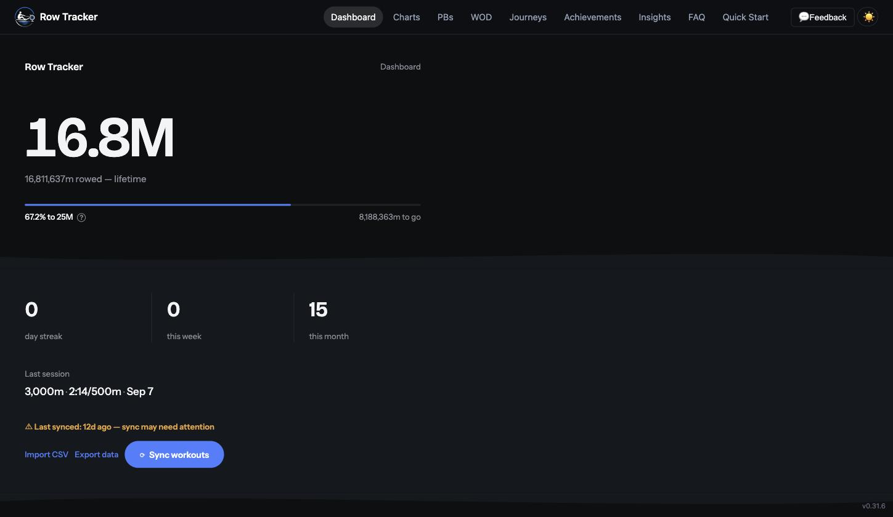
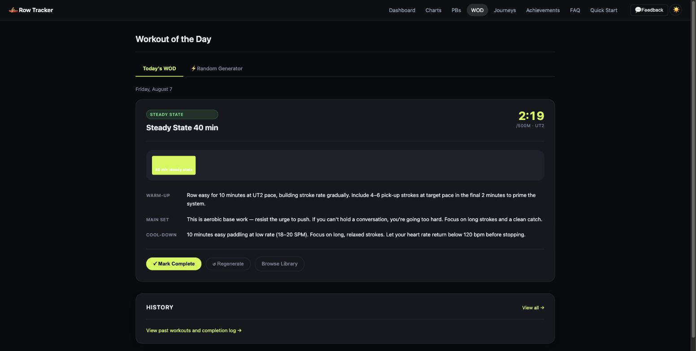
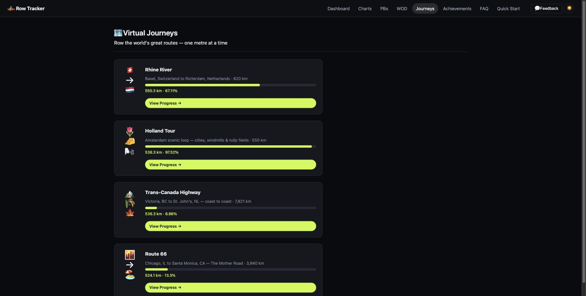
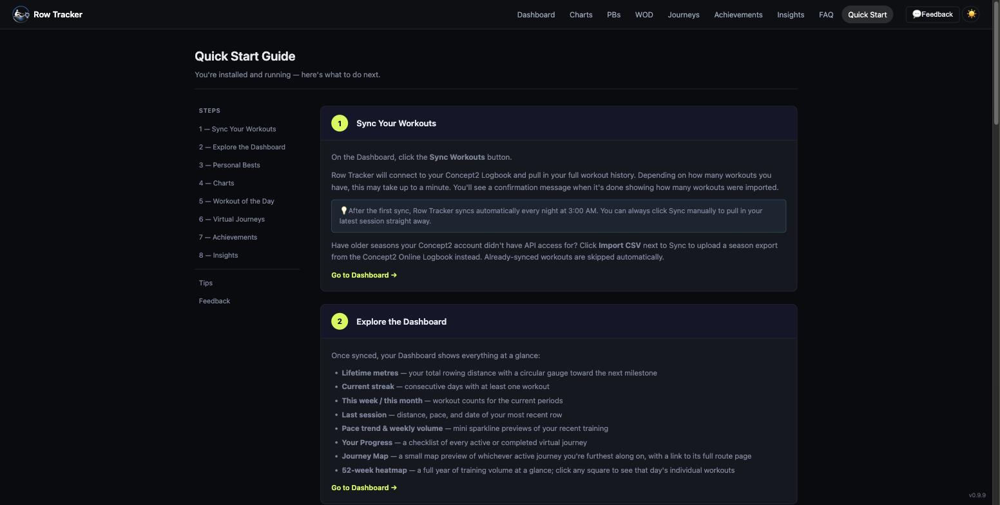

# 🚣 Row Tracker

A self-hosted personal rowing tracker for Concept2 RowErg athletes. Syncs automatically from the Concept2 Logbook API, tracks personal bests, generates daily workouts, and turns your metres into virtual journeys around the world.

Built with Flask, SQLite, and Docker. Runs on a home server at a single port with no external dependencies.

---

## Screenshots

### Dashboard


### Workout of the Day


### Virtual Journeys


### Quick Start Guide


---

## Features

**Training Data**
- Automatic sync from the Concept2 Logbook API — nightly at 3:00 AM, or on demand
- Full workout history with paginated list and enriched detail view
- Enriched workout detail — heart rate (min/avg/max/ending with zone classification), per-split breakdown, avg watts, drag factor, stroke count
- 52-week volume heatmap — click any day to see that session's details

**Personal Bests**
- 8 categories: 100m, 500m, 1000m, 2000m, 5000m, 10000m, 30min, 60min
- Recalculated automatically after every sync
- Improvement delta vs previous PB
- Stale flag for PBs not tested in 90+ days

**Charts**
- Pace over time with 10-session rolling average
- Stroke rate vs pace efficiency scatter
- CAWR (acute:chronic workload ratio) load management chart

**Workout of the Day**
- Rule-based periodization engine — reads last 28 days to set training phase
- Target pace calculated from your 2k PB with zone offsets
- Warm-up, main set, cool-down, and coaching notes generated daily
- Random WOD generator — choose intensity, effort level, and workout type
- 27 distinct workout templates; full WOD history log

**Gamification**
- 16 badges across Performance, Volume, Consistency, and Efficiency categories
- Season challenges — quarterly distance, PB attempts, consistency, monthly volume
- You vs. Past You — compare this month against last month, 3 months ago, and 12 months ago
- Stale PB nudges on the Achievements hub

**Virtual Journeys**
- Row the world's great routes — metres rowed move you along the route in real time
- Rhine River — Basel, Switzerland to Rotterdam, Netherlands · 820 km · 14 waypoints
- Holland Tour — Amsterdam scenic loop · 550 km · 17 waypoints
- Trans-Canada Highway — Victoria, BC to St. John's, NL · 7,821 km · 23 waypoints
- Route 66 — Chicago, IL to Santa Monica, CA · 3,940 km
- Waypoint ETAs based on 28-day rolling average pace
- Multiple journeys can run simultaneously

**Other**
- Dark mode default with light mode toggle (persisted)
- Fully responsive — iPhone and iPad optimised with hamburger nav drawer
- In-app feedback form (email delivery via Flask-Mail)
- FAQ and Quick Start guide included

---

## Tech Stack

| Layer | Technology |
|---|---|
| Backend | Python 3.11 · Flask · SQLAlchemy |
| Database | SQLite (single file, Docker volume) |
| Scheduler | APScheduler (embedded, nightly sync) |
| Frontend | Jinja2 · Vanilla JS · Chart.js |
| Container | Docker · Docker Compose |
| Email | Flask-Mail · Gmail SMTP |
| Data source | Concept2 Logbook API |

---

## Self-Hosting

### Prerequisites

- Docker and Docker Compose
- A Concept2 Logbook account with workout history
- A Concept2 API bearer token (request from [log.concept2.com](https://log.concept2.com))
- A Gmail account with an app password (for the feedback email feature)

### Setup

**1. Clone the repo**

```bash
git clone https://github.com/yourusername/row-tracker.git
cd row-tracker
```

**2. Create your `.env` file**

```bash
cp .env.example .env
```

Edit `.env` and fill in your credentials:

```
SECRET_KEY=your-secret-key-here
C2_CLIENT_ID=your-c2-client-id
C2_CLIENT_SECRET=your-c2-client-secret
C2_REFRESH_TOKEN=your-c2-bearer-token
MAIL_USERNAME=your-gmail@gmail.com
MAIL_PASSWORD=your-gmail-app-password
USE_AI_WOD=false
```

**3. Build and run**

```bash
docker compose up -d --build
```

**4. Open the app**

```
http://localhost:7376
```

Click **Sync Workouts** on the dashboard to pull in your full workout history from the Concept2 Logbook.

---

## Project Structure

```
row-tracker/
├── app.py                  # Flask app factory
├── models.py               # SQLAlchemy models
├── c2_api.py               # Concept2 API client
├── pb_engine.py            # Personal best calculation
├── badge_engine.py         # Badge evaluation
├── wod_engine.py           # WOD generation
├── blueprints/
│   ├── tracker.py          # Core routes and HR zone filters
│   ├── wod.py              # Workout of the Day routes
│   ├── gamification.py     # Badges, challenges, journeys
│   └── feedback.py         # Feedback form
├── templates/              # Jinja2 HTML templates
├── static/                 # CSS and JS
├── data/                   # SQLite database (Docker volume)
├── .env.example            # Environment variable template
├── docker-compose.yml
└── Dockerfile
```

---

## Roadmap

- [ ] Per-stroke data visualisation (force curve, drive/recovery time per stroke)
- [ ] Chart visual polish
- [ ] Real map overlays for virtual journeys (Leaflet.js + OpenStreetMap)
- [ ] Push/email notifications for badges and milestones
- [ ] AI-assisted WOD generation (Anthropic API — feature-flagged)

---

## License

Personal use. Not intended as a general-purpose open source project — no support is offered and the codebase reflects one person's specific setup. Fork freely if it's useful to you.

---

*Built for a Concept2 RowErg. Tested on a Proxmox homelab with Docker and Portainer.*
